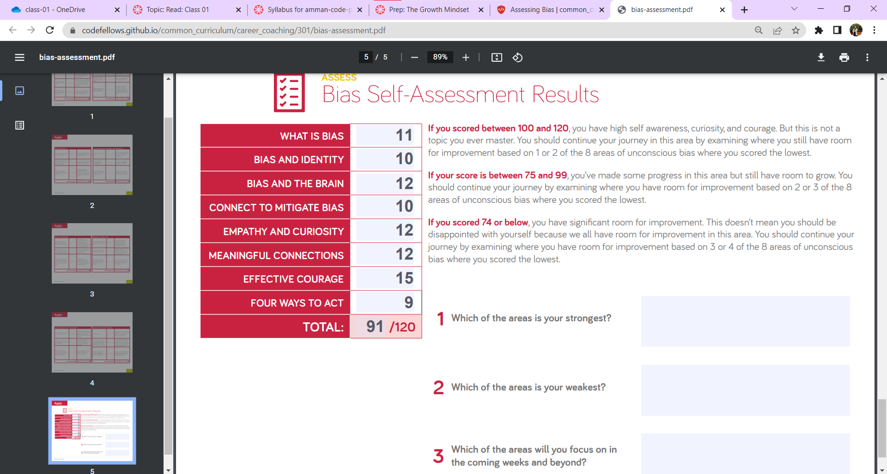

### Upgrade your technical skills with deliberate practice

you should Improving your hard technical skills by practicing that makes all the software you build better.

You can't rely on your day job to continually challenge you ,
That's where deliberate practice comes in.
 Deliberate practice can be summarized as:

Activities designed, typically by a teacher, for the sole purpose of effectively improving specific aspects of an individual’s performance.

The key ideas behind deliberate practice is that it:

Pushes you just outside your comfort zone
Repeated often
Feedback on results in continuously available
It's highly demanding mentally
It's difficult
It requires good goals

The goals of the challenges should be picked such that achieving them teaches you something new. It doesn't matter a great deal what the end result is, only what you learned on the way.

### The power of believing that you can improve
in this TED Talk, psychologist Angela Lee Duckworth discusses the concept of "grit" as a predictor of success. She defines grit as a combination of passion and perseverance, or the ability to stick with something even when it gets tough.
Duckworth explains that she became interested in the topic of grit when she was teaching math to seventh graders and noticed that some of her students who didn't have the highest IQs were still able to excel in the subject. She found that the common factor among these students was their level of grit.
Duckworth also talks about the importance of having a "growth mindset," or the belief that one's abilities can be developed through hard work and dedication. She notes that people with a growth mindset are more likely to have grit and be successful.

Finally, Duckworth encourages viewers to cultivate their own grit by finding their passion, practicing self-discipline, and maintaining a sense of purpose and hope even in the face of adversity.

### Alain de Botton on Redefining Success
De Botton suggests that we need to redefine success to include qualities such as compassion, empathy, self-awareness, and a sense of purpose. He argues that we need to find ways to incorporate these qualities into our daily lives and our work, rather than seeing them as separate from success.

De Botton also encourages us to embrace failure and to see it as an important part of the learning process. He suggests that we should be kinder and more forgiving to ourselves when we fail, and that we should be more supportive of others when they fail.

Overall, de Botton's message is that success should be defined in a way that prioritizes our emotional well-being and our relationships with others, rather than just external accomplishments. He believes that by doing so, we can create a kinder, gentler, and more fulfilling society for everyone.

### Upgrade Your Technical Skills with Deliberate Practice

The author argues that building software alone does not necessarily make a programmer better. To improve one's technical skills, deliberate practice is required, which involves activities designed to effectively improve specific aspects of one's performance. Deliberate practice involves pushing oneself just outside one's comfort zone, repeating activities often, receiving continuous feedback on results, demanding mental exertion, being difficult, and having clear goals. The author recommends setting challenges that push oneself out of their comfort zone, repeatedly work through the same sort of problems, and teach something new. Examples of such challenges include the Matasano Crypto Challenges and Rosalind, both of which are sets of exercises that relentlessly pummel developers with problems that require hard, focused thinking and fiddly solutions, and provide continual feedback. The author encourages programmers to step away from the latest frameworks and databases and set themselves small, finishable challenges that teach them something outside their comfort zone. 

## BIASES

